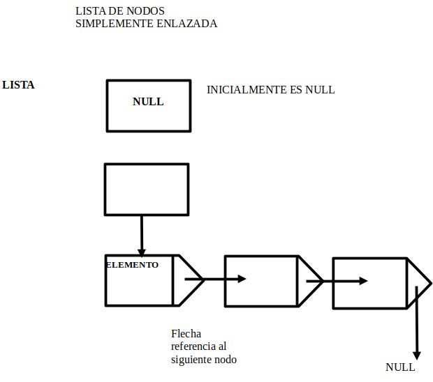
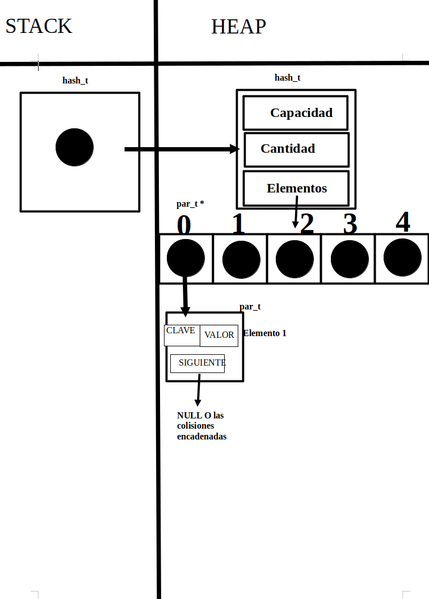

<div align="right">

</div>

# TP2

## Repositorio de (Nombre Apellido) - (Padrón) - (Mail)

- Para compilar:

```bash
make pruebas_chanutron
make main
```

- Para ejecutar:

```bash
/pruebas_chanutron
./main

```

- Para ejecutar con valgrind:

```bash
make valgrind-chanutron
valgrind ./main
make
```
---
##  Funcionamiento

En este TP2 se continuo el desarrollo del TP1, en el cual se creo un TDA que permitia cargar un archivo con pokemon y acceder a dicha informacion, que contenia Pokemon, su tipo, y seguidamente 3 ataques que le seguian al mismo.En este TP2 junto a lo hecho en el primer TP y utilizando TDA que vimos en la materia, se desarollo un juego en el que utilizamos dichos pokemones previamente dichos.
Para este juego se pidio 2 jugadores, uno que sera la "maquina" y el otro el usuario, aunque mi implementacion tiene una posibilidad de poder implementar un segundo jugador.Para ello defini un struct en juego.c: 

```c
struct juego {
	lista_t *lista_pokemon;
	informacion_pokemon_t *pokemones_archivo;
	bool estado_juego;
	struct datos_jugador jugador_1;
	struct datos_jugador jugador_2;
	int turnos;
};
```

El struct `juego` guarda una lista_t de los pokemones que se encontraban en el archivo, un `informacion_pokemon_t` que es el mismo archivo, luego un bool `estado_juego` que determina cuando el juego se acaba , un contador de `turnos` para determinar cuando se jugo la cantidad maxima, predeterminada por la cantidad de ataques y pokemon que tenga el usuario.Y por ultimo un `strcut datos_jugador`.

```c
struct datos_jugador {
	int puntos;
	lista_t *pokemones;
	char ataques_utilizados[9][20];
};
```

Guardando los movimientos que utiliza cada jugador en un vector char estatico, el mismo tiene la funcionalidad para poder implementarse otro jugador usuario si se desea (en este caso, `adversario.c` es el otro jugador) con tambien una lista_t que contiene los pokemon del usuario y los puntos que consigue a lo largo de la partida.Determinados por las efectividades de los tipos sobre otros.Los mismos estan definidos en un enum en juego.h.

Por otro lado `adversario.c` tiene el siguiente struct para llevar la informacion de la partida:

```c
struct adversario {
	lista_t *lista_pokemon;
	lista_t *pokemones_jugador;
	lista_t *pokemones_adversario;
	lista_t *ataques_posibles;
	jugada_t jugadas_posibles[9];
	int turnos;
};
```

Guarda en `lista_pokemon` los pokemones con los que puede trabajar, en `pokemones_jugador` los pokemones del usuario, `pokemones_adversario` guarda los pokemones que a seleccionado para el juego,
`ataques_posibles` los char* ataque posibles y en jugada_t `jugadas_posibles[9]` en cada posicion guarda un ataque para realizarlo contra el usuario.Como tambien un contador de turnos.

Explicando por ahora como se conforma cada uno y las condiciones del juego, el juego se desarrolla a lo largo de 9 turnos , donde cada jugador decidira que ataque realizar frente a su contricante, hasta alcanzar el limite de ataques posibles.Prosigo a explicar como se decidio desarrollar en primer caso, el juego, luego el adversario y el main.

## Implementacion

Consideraciones del TP

- El adversario siempre usara los dos primeros pokemon , y en su seleccion de pokemon numero 3, le dara al usuario un pokemon que no tenga.
- Teniendo en cuenta que el archivo sea correcto, se considera que siempre los ataques seran diferentes, y cada pokemon de tu equipo tendra ataques diferentes.
- Se utilizaron los TDA de Lista para guardar los pokemones, y de HASH para guardar cada comando del menu, explicado luego en el main.

### Juego y Jugador :

El juego , y cada uno de los jugadores y su informacion nse encuentran en el archivo `juego.c` con los struct definidos anteriormente.Primero se crea el juego , el cual , carga los archivos pokemon del TP1, reservando memoria para el mismo e inicializando los valores y los puntos del mismo , en la funcion `juego_crear()` la cual , tiene complejidad O(1), a pesar de que haya un for que inicialize los valores del vector ataques_utilizados, es de manera constante.Luego tenemos `juego_cargar_pokemon` , retornando un enum `JUEGO_ESTADO` indicando si se pudo o no cargar los pokemones, recibiendo un puntero al juego creado y el archivo , la misma que es O(n) ya que depende de la cantidad de pokemones, para ir insertando en la lista_pokemones cada uno de los pokemon O(1).
Tambien tenemos `juego_listar_pokemon`  que es O(1) , solamente retorna una lista a la lista interna guardada en el TDA juego, para uso luego.
Luego ya pasariamos a la parte donde el usuario ya interactua con el juego, con `juego_seleccionar_pokemon` O(n) , que recibe el puntero al juego y se le indica con un enum si se trata del jugador 1 o el jugador 2 ```c JUGADOR 1 JUGADOR 2``` , y los nombres que haya elegido cada usuario.Destacar que el tercer pokemon es para el rival , pero para mi implementacion decidi guardarlos de igual manera en la lista_pokemon de cada jugador, y luego usar una funcion auxiliar para intercambiar el ultimo valor, siendo que siempre son 3 pokemon , el pokemon en la posicion 2 sera el pokemon para el contrario.
```c
void juego_reasignar_pokemon(juego_t *juego)
{
	if (!juego) {
		return;
	}
	pokemon_t *aux_pokemon =
		lista_elemento_en_posicion(juego->jugador_1.pokemones, 2); // guardo el ultimo pokemon del jugador 1
	lista_quitar_de_posicion(juego->jugador_1.pokemones, 2); // lo quito
	lista_insertar_en_posicion(
		juego->jugador_1.pokemones,
		lista_elemento_en_posicion(juego->jugador_2.pokemones, 2), 2); // Le inserto el elemento en la ultima posicion de la lista pokemon del jugador contrario.
	lista_quitar_de_posicion(juego->jugador_2.pokemones, 2); // Quito y luego reemplazo .
	lista_insertar_en_posicion(juego->jugador_2.pokemones, aux_pokemon, 2);
}
```
Tambien utiliza un comparador de nombres, para evaluar si el nombre pasado por el usuario es correcto o no.
Pasando ya a la jugabilidad tenemos a `juego_jugar_turno` , funcion que, recibe el juego y las jugadas de cada jugador `jugada_t` que contiene el nombre, y el ataque que haya decido el usuario hacer , y retornara segun como se evualue con la tabla de tipos, si el ataque del jugador 1 es efectivo frente al otro o viceversa, como tambien si fue un ataque normal.Para ello se busca si existe el pokemon en la lista_pokemones de cada usuario, luego se busca si el ataque es el correcto, y por ultimo se evalua si el ataque fue utilizado, segun de acuerdo al vector que posee cada usuario de ataques usados.Si las condiciones son las correctas, `comprobar_efica_ataque` sacara la eficacia de cada jugador, y `calcular_puntos` evualuara cuantos puntos se le asigna a cada jugador.Tras cada llamada a `juego_jugar_turno` se aumentara el turno jugado.

Y por ultimo las 3 funciones mas simples por parte del juego son `juego_obtener_puntaje` O(1) que recibe el puntero a juego y el jugador que se desea obtener el puntaje, devolviendolo en tipo int, `juego_finalizado` O(1) evualuara si los turnos jugados son iguales a 9, cuando se cumpla la condicion , el booleano interno de la estructura de juego pasara a ser `true` indicando que el juego finalizo.Y por ultimo `juego_destruir` :

```c
void juego_destruir(juego_t *juego)
{
	if (!juego) {
		return;
	}
	lista_destruir(juego->jugador_1.pokemones); // destruye las listas_t de los pokemones que posee cada usuario
	lista_destruir(juego->jugador_2.pokemones);
	lista_destruir(juego->lista_pokemon); // destruye la lista_t de todos los pokemones
	pokemon_destruir_todo(juego->pokemones_archivo); // destruye el archivo de pokemones
	free(juego); // finalmente libera toda la memora
}
```

### Adversario

El adversario en este TP es el que se enfrenta al usuario.Para ello mismo el adversario posee unas ciertas funciones que lo ayudan a tomar decisiones a la hora de eligir sus jugadas, y los pokemones.Inicialmente se utiliza a `adversario_crear` O(1) , la cual crea el mismo y se le asigna la lista_t de pokemones que se consiguio leyendo el archivo, inicializando los otros valores del struct en 0.

Luego tendriamos `adversario_seleccionar_pokemon` y `adversario_pokemon_seleccionado` , ambas comportandose similar a la funcion de seleccionar de juego y entre ellas, pero con motivos diferentes.La primera en cuestion el adversario selecciona sus pokemon , y la segunda le informa los pokemones que eligio el jugador contrario.En mi implementacion , la seleccion de pokemon del adversario depende de lo seleccionado por el jugador contrario, ya que en `adversario_pokemon_seleccionado` O(n) ya que debe buscar cada pokemon de acuerdo a su nombre, guarda en una lista para si mismo los pokemones que el jugador usuario haya elegido, comprobando previamente que existan en su lista_pokemon totales, y luego `adversario_seleccionar_pokemon` O(n) se encargara de tomar los valores que hay en esa lista, para buscar un pokemon el e cual darle al jugador usuario en un bucle while 
```c 
while (lista_elemento_en_posicion(adversario->lista_pokemon, 0) ==
		       buscar_pokemon ||
	       lista_elemento_en_posicion(adversario->lista_pokemon, 1) ==
		       buscar_pokemon ||
	       lista_elemento_en_posicion(adversario->pokemones_jugador, 0) ==
		       buscar_pokemon ||
	       lista_elemento_en_posicion(adversario->pokemones_jugador, 1) ==
		       buscar_pokemon) {
		indice += 1;
		buscar_pokemon = lista_elemento_en_posicion(
			adversario->lista_pokemon, indice);
		nombre_aux = (char *)pokemon_nombre(buscar_pokemon);
}
```

Que el cual, como se detallo anteriormente, verifica que el pokemon que se busca sea diferente a los pokemones de la posicion 0 y 1 de la lista del jugador usuario, y tambien de la lista_pokemon, ya que siempre el jugador maquina elige los 2 primeros pokemones de la lista, hasta que se cumpla la condicion.
Por ultimo por parte de de la jugabiliad tenemos a `adversario_proxima_jugada` y `adversario_informar_jugada` , que en el caso de la ultima no se implemento ya que , como se ve en `adversario_proxima_jugada` el jugador maquina solamente ira en un orden preestablecido eligiendo sus ataques.Esta funcion devuelve un `jugada_t` de lo que el jugador maquina haya seleccionado jugar en el turno que se encuentre. Por ultimo `adversario_destruir` se encarga de liberar las listas_t que se encuentren y el adversario.

### Menu y main

Por ultimo tenemos ya la implementacion de lo desarrollado anteriormente en un menu(`menu.h`,`menu.c`) interactuable por parte del usuario.Para ello se utilizo el TDA HASH para la creacion de un menu con comandos, asignados a preferencia del programa, el cual guarda una clave con la funcion asociada para hacer el llamado de dicha funcion,asi su utilizacion permite un mejor manero para la interaccion entre las diferentes funcionalidades del main.Sus complejidades de cada funcion son: 

- `menu_crear` : se encarga de crear el menu , es O(1).
- `menu_agregar_comando` : Asigna memoria para la estructura de `informacion_comando` , dicha complejidad depende de la complejidad promedio del `hash_insertar` , pero para esta situacion es O(1).
- `menu_ejecutar_comando`: Obtiene el comando se que busca, si la tabla hash esta implementada bien, en esta situacion es O(1).
- `destruir_elementos` : Funcion auxiliar para eliminar los elementos, solo hace una llama a `free` por lo tanto es O(1).
- `menu_destruir`: libera la memoria almacenada, en el peor de los casos es O(n) .

Explicado el menu y su funcionalidad, pasemos al main.El main es el que se encarga de conectar todo lo visto anteriormente.Primero se crean los comandos el cual se desea que el usuario utilize para jugar , para ello se utiliza tambien un struct para guardar informacion de la partida: 

```c

struct estado_juego {
	juego_t *juego; //struct juego
	menu_t *menu; //el menu con los comandos
	lista_t *pokemon_jugador; // pokemones del jugador
	lista_t *pokemon_adversario; // pokemones del adversario
	bool continuar; //indica si se desea continuar jugando
	bool juego_iniciado; // indica cuando se desarolla el juego
	bool archivo_cargado; // comprobar si un archivo se cargo, caso que si, no se podra cargar otro archivo hasta jugar la partida
};

```

En el main inicializo los valores, y creo cada comando con la funciones principales del juego:

```c
struct estado_juego estado = { .continuar = true,
				       .juego_iniciado = false,
				       .archivo_cargado = false }; // inicializo los valores
	menu_t *menu = menu_crear();
	menu_agregar_comando(menu, "v", "Ver comandos", mostrar_comandos);
	menu_agregar_comando(menu, "l", "Listar pokemones", listar_pokemones);
	menu_agregar_comando(menu, "m", "Tabla de tipos", mostrar_tabla_tipos);
	menu_agregar_comando(menu, "c", "Cargar un archivo", cargar_archivo);
	menu_agregar_comando(menu, "j", "Iniciar la partida", jugar);
	menu_agregar_comando(menu, "q", "Finalizar juego", finalizar_juego);
	mostrar_comandos();
```

Explicacion breve de cada funcion: 

- `mostrar_comandos` : simplemente es un print que muestra al usuario cada comando para interacturar.O(1).
- `listar_pokemones` : muestra una lista de pokemones con la funcion auxiliar `mostrar_pokemon`. O(n).
- `mostrar_tabla_tipos` : se encarga de hacer un printf con la explicacion de que es cada tipo.O(1).
- `cargar_archivo` : carga el archivo que el usuario indique.Detalla si lo encuentra o no. O(1).
- `jugar` : inicia el juego. O(1).
- `finalizar_juego` : cambia el booleano de continuar , finalizando el programa. O(1).

Pasando a explicar un poco mas en profundidad las funciones complejas y algun que otra funcion auxiliar, `cargar_archivo` y cada una de estas funciones reciben el struct estado, para cambiar sus valores o utilizarlos para informar respecto a algo, con ello, `cargar_archivo` utilizando `juego_cargar_pokemon` , con la linea ingresada por el usuario , cargara en caso de exito la lista de pokemones, e informara al usauario si la carga fue completa o no.Por otro lado jugar, siendo la funcion mas compleja del main, la misma a lo largo de 9 turnos, se encargara de pedir al usuario que pokemones desea usuar primero, guardarlos con la funcion auxiliar `guardar_pokemon_jugador`
```c

lista_t *guardar_pokemones_jugador(void *e, lista_t *lista, char nombre_1[],
				   char nombre_2[], const char *nombre_3)
{
	if (!e) {
		return NULL;
	}
	struct estado_juego *estado = e;
	if (!estado) {
		return NULL;
	}
	pokemon_t *pokemon_1 = lista_buscar_elemento(
		juego_listar_pokemon(estado->juego), comparar_nombre_pokemon,
		(void *)nombre_1);
	pokemon_t *pokemon_2 = lista_buscar_elemento(
		juego_listar_pokemon(estado->juego), comparar_nombre_pokemon,
		(void *)nombre_2);
	pokemon_t *pokemon_3 = lista_buscar_elemento(
		juego_listar_pokemon(estado->juego), comparar_nombre_pokemon,
		(void *)nombre_3);
	lista_t *lista_con_pokemones = lista_crear();
	lista_insertar(lista_con_pokemones, pokemon_1);
	lista_insertar(lista_con_pokemones, pokemon_2);
	lista_insertar(lista_con_pokemones, pokemon_3);
	return lista_con_pokemones;
}
```
Que sigue una funcionalidad similar a la seleccion de pokemon, una vez ya cargado los datos necesarios, pedira al usuario con la funcion `seleccionar_jugada` su jugada , y llamara a la funcnio `juego_jugar_turno` con la jugada que haya decido el usuario.Informa al usuario si hubo un error en el ataque y si no, informara la efectividad de aca ataque con la funcion .`mostrar_efectividad_ataque` y con `lista_con_cada_elemento` mostrara los datos del equipo con la funcion auxiliar `mostrar_datos_equipo` , funcion que muestra deacuerdo al jugador.
Finalizado el juego se mostrara los puntos y quien gano, para asi liberar memoria ,liberando al usuario, las listas, y el juego.El usuario tiene la capacidad de volver cuantas veces lo desee.

--- 

### TDA UTILIZADOS:


## TDA LISTA

<div align="center">

</div>

- Operaciones del TDA LISTA:
- Crear lista. O(1).
- Insertar un elemento. O(1) al inicio O(n) en posicion especifica o al final.
- Eliminar un elemento. O(1) al finicio O(n) en posicion especifica o al final.
- Verificar si está vacía. O(1)
- Ver elemento de la lista. O(1) al inicio O(n) en posicion especifica o al final.
- Conseguir cantidad de elementos de la lista. O(n).
- Destruir lista. O(n).

## TDA HASH

<div align="center">

</div>

- Operaciones del TDA HASH:
- Crear el HASH O(1)
- Insertar elementos O(1) O(n) si hay colisiones constantes
- Quitar elementos O(1) O(n) si hay colisiones constantes
- Obtener elemento O(1) O(n) si hay colisiones constantes
- Verificar Si existe contenido O(1) O(n) si hay colisiones constantes
- Recorrer el Hash con un iterador interno O(n)
- Destruir el Hash y sus elementos O(n)